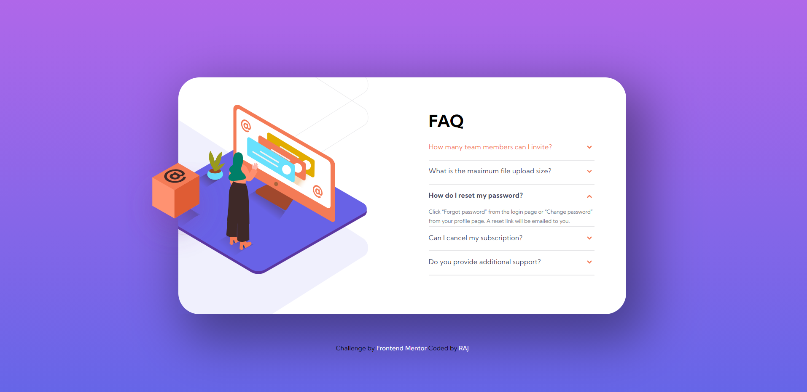
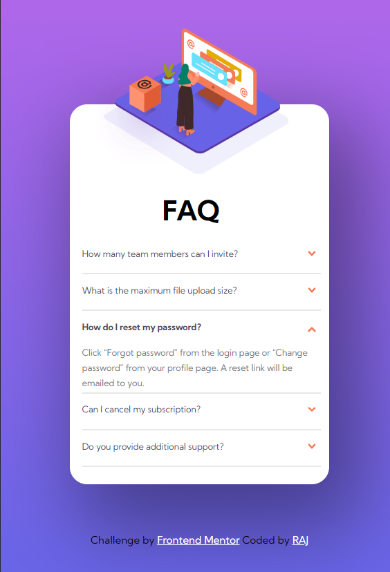

# Frontend Mentor - FAQ accordion card solution

This is a solution to the [FAQ accordion card challenge on Frontend Mentor](https://www.frontendmentor.io/challenges/faq-accordion-card-XlyjD0Oam). Frontend Mentor challenges help you improve your coding skills by building realistic projects. 

## Table of contents

- [Overview](#overview)
  - [The challenge](#the-challenge)
  - [Screenshot](#screenshot)
  - [Links](#links)
- [My process](#my-process)
  - [Built with](#built-with)
  - [What I learned](#what-i-learned)
  - [Continued development](#continued-development)
  - [Useful resources](#useful-resources)
- [Author](#author)
- [Acknowledgments](#acknowledgments)

## Overview

### The challenge

Users should be able to:

- View the optimal layout for the component depending on their device's screen size
- See hover states for all interactive elements on the page
- Hide/Show the answer to a question when the question is clicked

### Screenshot




### Links

- [see solution on frontend mentor](https://www.frontendmentor.io/solutions/faq-accordion-card-without-using-js-jlPXQFMeh)
- [live site URL](https://verreauxblack.github.io/frontendmentor-challenge/2-Fqa-accordion-card/)

## My process

### Built with

- Semantic HTML5 markup
- CSS custom properties
- Flexbox
- CSS Grid
- Mobile-first workflow
- Accordion

### What I learned

- I learn How to build accordion without using JS

To see how you can add code snippets, see below:

```html
<div class="fqa-container">
        <div>
          <input type="radio" name="question" id="question1">
          <label for="question1">How many team members can I invite?</label>
          <div class="answer">
            You can invite up to 2 additional users on the Free plan. here is no limit on team members for the Premium plan.
          </div>
        </div>
        <div>
          <input type="radio" name="question" id="question2">
          <label for="question2">What is the maximum file upload size?</label>
          <div class="answer">
            No more than 2GB. All files in your account must fit your allotted storage space.
          </div>
        </div>
        <div>
          <input type="radio" name="question" id="question3">
          <label for="question3">How do I reset my password?</label>
          <div class="answer">
            Click “Forgot password” from the login page or “Change password” from your profile page.
            A reset link will be emailed to you.
          </div>
        </div>
        <div>
          <input type="radio" name="question" id="question4">
          <label for="question4">Can I cancel my subscription?</label>
          <div class="answer">
            Yes! Send us a message and we’ll process your request no questions asked.
          </div>
        </div>
        <div>
          <input type="radio" name="question" id="question5">
          <label for="question5">Do you provide additional support?</label>
          <div class="answer">
            Chat and email support is available 24/7. Phone lines are open during normal business hours.
          </div>
        </div>
      </div>
```
```css
.fqa-container {
  width: 100%;
  margin: auto;
}

.fqa-container .answer {
  width: 98%;
  width: calc(100% - 20px);
  margin: 0 auto;
  height: 0;
  color: rgba(0, 0, 0, 0);
  background-color: rgba(255, 255, 255, 0.2);
  line-height: 23px;
  padding: 0px;
  font-size: x-small;
  -webkit-transition: 0.2s;
  transition: 0.2s;
  border-bottom: 2px solid var(--Light-grayish-blue);
}

.fqa-container label {
  cursor: pointer;
  border-bottom: 1px solid rgba(255, 255, 255, 0.1);
  display: block;
  padding: 15px;
  padding-left: 10px;
  width: 100%;
  color: var(--Very-dark-grayish-blue);
  font-weight: 400;
  font-size: small;
  z-index: 100;
}

.fqa-container label:hover {
  color: var(--Soft-red);
}

.fqa-container input:checked + label:hover {
  color: var(--Very-dark-grayish-blue);
}

.fqa-container input {
  display: none;
}

.fqa-container label:before {
  font-family: 'Kumbh Sans', sans-serif;
  content: url(../images/icon-arrow-down.svg);
  font-weight: bolder;
  float: right;
  -webkit-transition: 0.5s;
  transition: 0.5s;
}

.fqa-container input:checked + label {
  font-weight: 700;
}

.fqa-container input:checked + label:before {
  font-family: 'Kumbh Sans', sans-serif;
  content: url(../images/icon-arrow-down.svg);
  -webkit-transform: rotate(180deg);
          transform: rotate(180deg);
  -webkit-transition: 0.5s;
  transition: 0.5s;
}

.fqa-container input:checked ~ .answer {
  height: auto;
  color: var(--Dark-grayish-blue);
  -webkit-transition: 0.5s;
  transition: 0.5s;
  font-size: x-small;
  line-height: 18px;
}

```

### Continued development

Learning is a very beautiful thing in the world. So, I will continue my learning in pure css

### Useful resources

- [Accordion resource](https://codepen.io/dandiws/pen/qqyeed) - This helped me for Accordion concept.

## Author

- Frontend Mentor - [@verreauxblack](https://www.frontendmentor.io/profile/verreauxblack)
- Twitter - [@verreauxblack](https://www.twitter.com/verreauxblack)

## Acknowledgments

I want thank to Dandiws. His pen helped me lot
